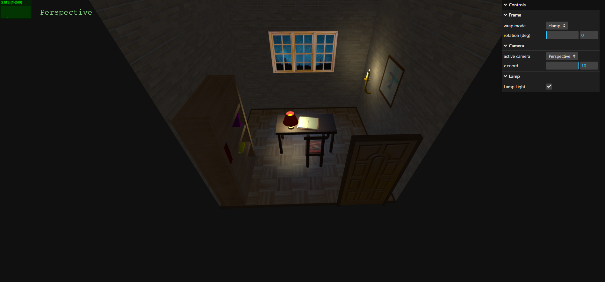

# SGI 2025/2026 - PW1

## Group T03G06

| Name             | Number    | E-Mail             |
| ---------------- | --------- | ------------------ |
| Gonçalo Pinto    | 202204943 | up202204943@up.pt  |
| Leonardo Ribeiro | 202205144 | up202205144@up.pt  |
| Manuel Mo        | 202205000 | up202205000@up.pt  |

----
## Project information

- Objects:
  - `Lamp`: A realistic table lamp featuring a metallic golden base and neck, a bright red conical lampshade, and a glowing yellow bulb that emits warm light through a spotlight. The lamp’s design combines soft curves with vivid color contrast.
  - `Table`: a simple rectangular table with 4 legs and with wood texture.
  - `Chair`: A realistic wooden chair. It has a square wooden seat with four cylindrical legs, a rope-woven backrest made of thin horizontal and vertical ropes (with rope texture), and a soft textured cushion placed on the seat.
  - `Candle`: A small realistic wax candle with a glowing yellow flame and a black wick, standing on a decorative golden holder with a round base and curved metal arms. The flame emits warm light, giving the candle a soft, luminous effect.
  - `Book`: A textured 3D book model featuring realistic leather covers, light cream-colored pages with detailed side textures, and subtle geometric tilts for natural placement. The book includes a wooden holder or spine structure, adding depth and realism to the scene.
  - `Closed Book`: A realistic 3D closed book model with a shiny front and back cover, a matte pages block, and a connecting spine. The model is fully parametric, allowing customization of cover color, page color, width, height, and thickness, making it suitable for a variety of interior or library scenes.
  - `Bookshelf`: A tall wooden bookshelf with three internal shelves, a solid back panel, and a smooth wood texture for a realistic finish.
  - `Picture Frame`: A square wooden frame containing a textured artwork plane, with adjustable wrapping and rotation of the artwork.
  - `Door`: A wooden door with a realistic textured panel, surrounded by a wooden frame, and featuring a metallic handle.

- Scene:
  - A cozy interior room with a wooden floor and mirrored-textured walls. The room features a table with an open book on it, accompanied by a chair and a lamp. A bookshelf nearby holds several colorful closed books. A lit candle adds warm ambiance, while a picture frame hangs on the wall and a wooden door provides an exit. A window allows natural light in, and subtle floor frames add structural detail. Ambient and spotlights illuminate the scene for realism.
  - Link: http://127.0.0.1:5500/pw1/
  - Screenshot [link](prints/scene.png)
  
----
## Issues/Problems

- The group did not have hard time developing this project and have done all the features.
