# SGI 2025/2026 - PW2

## Group T03G06

| Name             | Number    | E-Mail             | Percentages |
| ---------------- | --------- | ------------------ | -------- |
| Gonçalo Pinto         | 202204943 | up202204943@up.pt                | 33.33% |
| Leonardo Ribeiro         | 202205144 | up202205144@up.pt                | 33.33% |
| Manuel Mo         | 202205000 | up202205000@up.pt                | 33.33% |

----
## Project information

This project is a complete implementation of the SGI PW2 requirements, featuring a modular, interactive, and visually rich underwater scene. All mandatory features described in the official assignment have been implemented, along with several bonus features. Below, there is a detailed explanation of everything the project has.

## Objects Implemented

**MySubmarine** - Capsule, cylinder and extrude geometry composition. Physics-based movement with drag. Custom Fresnel shield shader. Dual spotlights and warning light. BVH collision detection.

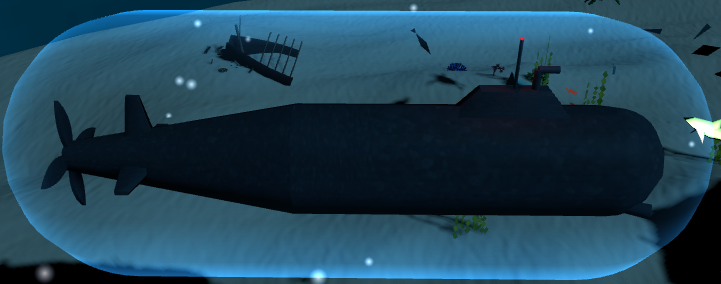

**MyJellyfish** - Hemisphere cap with animated border wave. TubeGeometry tentacles with procedural waving. LOD support. Internal SpotLight for bioluminescence.

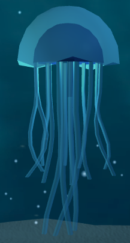

**MyBream Fish** - Procedurally generated vertex-by-vertex with LOD. Skeletal animation with bone-based swimming. Flocking behavior.

**MySlimFish** - Procedurally generated vertex-by-vertex with LOD. Skeletal animation with bone-based swimming. Flocking behavior.

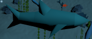

**MyTurtle** - Procedurally generated vertex-by-vertex. Swimming animation. Flocking behavior.

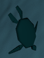

**MyShark** - Procedurally generated vertex-by-vertex with skeletal animation. KeyFrame animation for path behaviour.

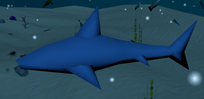

**MyCrab** - Cylinder based.

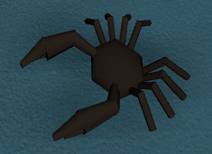

**MyStarFish** - Cylinder based with perlin noise shader.

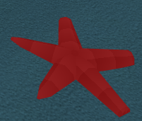

**MyAlga** - Cylinder based stalk with leaf planes with LOD. High detail with geometry, low detail with textured plane. Wave animation.

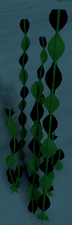

**MyRock** - Dodecahedron-based cluster with LOD. High and low detail variants.

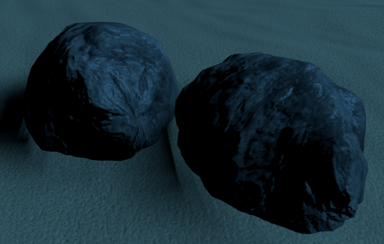

**MyCoral (Type 1)** - L-system generated procedural branches. Cylinder based construction. LOD support with animation.

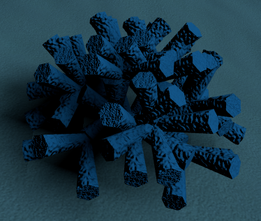

**MyCoralStochastic (Type 2)** - Stochastic L-system generated branches. Cylinder based construction. LOD support with animation.

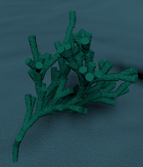

**MyTemple** - Composite structure with texture and collision detection.

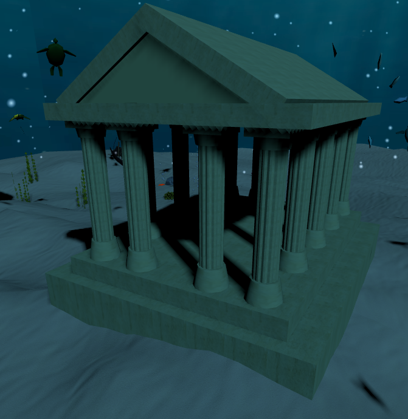

**MyShipwreck** - Composite structure with collision detection.

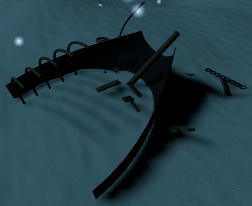

## HUD

**MyPeriscopeHUD** - Heads-up display overlay. Post-processing effects: chromatic aberration, vignette, scratches overlay (procedurally generated), crosshair texture. Real-time data display.

---

## Scene

**Terrain** - Generates a circular, procedurally generated terrain mesh using layered noise, including vertex positions, indices, UVs, and normals, then applies textures and creates the final mesh.

**MyHorizon** - Cylinder based background. Video texture for water surface.

**MyWaterCeiling** - Cylinder based surface. Video texture for water ceiling.

---

## Cameras

4 camera types implemented:

1. **Free-Fly Camera** - Perspective camera with orbit controls
2. **Submarine View** - First-person perspective synchronized with submarine
3. **Swim View** - Static camera above the water
4. **Fixed Aquarium View** - Orthographic static external view

---

## BVH (Bounding Volume Hierarchy) with Helper Visualization 

BVH acceleration implemented on:
- MyBreamFishShoal
- MySlimFishShoal
- MyTurtleShoal
- MyTerrain
- MyTemple
- MyShark
- MySubmarine

---

## Textures

**Terrain** Texture with anisotropic filter.

**Coral** Bump map texture.

**Rock** Displacement map texture.

**Submarine** - MIPMAP texture.

**Alga** - Image for a low detail alga.

**Temple** - Normal texture.

**Horizon** - Video texture.

**WaterCeiling** - Video texture.

All static textures are 1024×1024 or smaller. All of them also use power-of-two dimensions (2ⁿ), except for the HUD and the algae, which needs to be rectangular.
The video textures are in 720p.

---

## Particles

**MyMarineSnow** - THREE.Points particle system. Per-particle velocity and noise drift. Automatic boundary reset. Canvas-generated circular gradient texture. Additive blending.

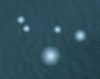

**MyBubbleParticles** - Geometry-based particle clusters. Floating upward animation.

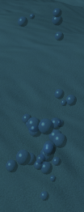

**MySandPuff** - Explosion-like particle effect triggered by terrain clicks. Radial emission with gravity and drag simulation. Time-based lifecycle.

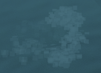

---

## Lights

**Directional Light** - Main sun light casting shadows. Shadow map with soft filtering.

**Submarine Lights** - Two adjustable spot lights (left and right). Adjustable color, intensity, angle via GUI.

**Submarine Warning Light** - Flashing indicator light with adjustable frequency.

**Jellyfish Light** - SpotLight not adjustable.

---

## Shadows

Shadow maps enabled with PCFSoftShadowMap for soft edges. Objects casting shadows: DirectionalLight, SpotLight, Submarine. Objects receiving shadows: Terrain, rocks, all meshes with receiveShadow enabled. Optimized shadow map resolutions for non-critical lights.
Shadows received on all objects except on the jelly fish.
Shadows cast on all objects except the jelly fish and the star fish.

---

## Shaders

**MyStarFishShader** - Custom ShaderMaterial with Perlin noise for procedural starfish patterning.

**MySubmarine Shield Material** - Custom ShaderMaterial with Fresnel effect for rim-lighting glow. Additive blending.

**HUD Shader Pass** - Post-processing ShaderPass for periscope effects: chromatic aberration, vignette, scratches overlay, crosshair blending.

**Depth of Field** - Toggleable bokeh post-process (three.js `BokehPass`) with adjustable focus, aperture and max blur using EffectComposer.

---

## Performance Optimizations

- LOD system lowering the number of vertexes for MySlimFish, MyBreamFish, MyRock, MyCoral, MyCoralStochastic, MyJellyfish.
- LOD system lowering the number of objects for MyBubbleParticles.
- LOD system putting an image instead of a mesh for MyAlga.
- BVH acceleration for raycasting
- Points-based particle system
- Optimized shadow maps

---

## Controls

- Free-Fly/Fixed View: Mouse drag to orbit, scroll to zoom.
- Submarine View: W (forward), A (left), S (backward), D (right), P (up), L (down).
- Click to select objects.
- GUI for real-time parameter adjustment.

## GUI

- Camera selection
- Toggle wireframe
- Toggle axis
- Toggle depth of field and adjust its settings
- Change the quantity of objects in the scene
- Toggle BVH and BVH visualization
- Toggle submarine shield and adjust its settings
- Adjust submarine lights
- Configure flock behavior for bream fish, slim fish, and turtles
- Toggle marine snow

## Design Choices

Since the project's theme is a deep-sea aquarium, a darker visual style was chosen, featuring a rich ecosystem with prey, predators, and diverse flora. All elements in the scene aim to be close to reality (color, animation, texture, etc.).

Each object is created in its own file, which is called from a group if there are multiple instances, or directly in MyContents. MyContents has access to all objects and can modify everything, allowing selection, toggling BVH, toggling wireframes, and so on. MyApp handles the rendering of things such as cameras, depth of field, and the HUD.

From a technical perspective, we only used what was required. No additional imports were used.

## Known Limitations

Although many optimizations were implemented, the scene is still somewhat heavy. Other than that, there are no known limitations in this project.

## Features Not Implemented

As mentioned above, all features in the assignment have been implemented.